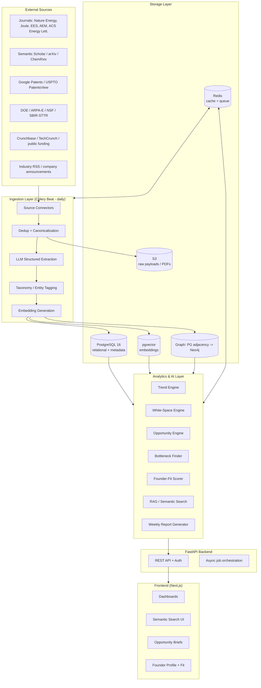
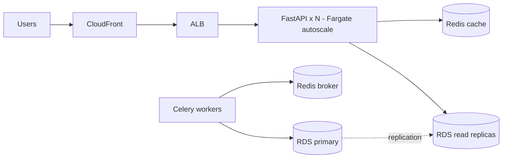

# System Architecture

Principal-architect view of the Battery Opportunity Scanner (BOS). This document covers the deliverables: **architecture diagram, technology stack justification, scaling plan, and deployment strategy**. Schema, API, algorithms, roadmap, and folder structure live in their own docs.

---

## 1. Architecture overview

BOS is a **signal-synthesis platform**. Raw ecosystem data (papers, patents, grants, funding, news) flows through a normalization + enrichment pipeline into three serving layers — relational, vector, and graph — which power an analytics/AI layer that produces the *synthesized* outputs users actually care about (trends, opportunities, white space, founder fit).

### Design principles

1. **Synthesis over retrieval.** The product value is in derived intelligence, not raw listings. Every pipeline stage exists to make downstream synthesis cheaper and higher-signal.
2. **Idempotent, replayable pipelines.** Each connector run is deterministic given a watermark; raw payloads are archived in S3 so enrichment can be re-run when models improve.
3. **Three serving shapes for three query shapes.** Relational (facts/filters), vector (semantic similarity), graph (relationship traversal). Each is the right tool for a distinct question.
4. **LLM at the edges, not the core of truth.** LLMs extract structure and synthesize narratives, but scores are computed by deterministic, auditable algorithms so results are explainable and reproducible.
5. **Cost-bounded AI.** Embeddings and extraction are batched, cached, and gated by dedup so we never pay to process the same content twice.

---

## 2. Component responsibilities

### Ingestion layer
- **Source connectors** — one adapter per source implementing a common `Connector` interface (`fetch(since) -> RawRecord[]`). Connectors are scheduled by Celery Beat, run as Celery tasks, and are independently retryable/rate-limited.
- **Dedup + canonicalization** — collapse the same artifact arriving from multiple sources. Strategy in [DATABASE_SCHEMA.md](DATABASE_SCHEMA.md#deduplication-strategy).
- **LLM structured extraction** — turn unstructured abstracts/claims/news into typed fields (entities, technologies, claims, problems addressed) via function-calling with a strict JSON schema.
- **Taxonomy/entity tagging** — map free text to a controlled battery taxonomy (chemistries, components, applications, processes) + named entities (orgs, people, institutions) with link resolution.
- **Embedding generation** — `text-embedding-3-large` (3072-d) for documents; stored in pgvector with HNSW index.

### Storage layer
- **PostgreSQL** — source of truth for entities, documents, signals, taxonomy, users.
- **pgvector** — embedding columns co-located with rows for join-friendly hybrid search.
- **Graph** — relationship store; PG adjacency tables in MVP, Neo4j when traversal depth/centrality dominates (ADR-001 below).
- **S3** — raw JSON/PDF payloads, generated reports.
- **Redis** — Celery broker/result backend + hot caches (search, dashboards).

### Analytics & AI layer
Stateless services that read storage and write derived tables (`trend_scores`, `opportunities`, `white_spaces`, `bottlenecks`). Run on schedules and on-demand. Algorithms in [ALGORITHMS.md](ALGORITHMS.md).

### API + frontend
FastAPI exposes REST; Next.js consumes it. Contracts in [API_DESIGN.md](API_DESIGN.md).

---

## 3. Technology stack justification

| Layer | Choice | Why this, why not the alternative |
|-------|--------|-----------------------------------|
| Frontend | **Next.js 14 + TS + Tailwind** | App Router gives server components (fast dashboards, SEO for marketing), TS for safety, Tailwind for velocity. Alt (plain React/Vite) loses SSR + routing conventions. |
| Data fetching | **TanStack Query** | Cache/invalidation for dashboard-heavy UI without hand-rolled state. |
| Backend | **FastAPI + Pydantic v2** | Async I/O is ideal for fan-out connectors and OpenAI calls; auto OpenAPI; Pydantic validation matches our heavy LLM-JSON contracts. Alt (Django) is heavier and sync-first. |
| ORM/Migrations | **SQLAlchemy 2 + Alembic** | Mature async support, explicit migrations. |
| Relational DB | **PostgreSQL 16** | One engine for relational + vector + JSONB + full-text. Operationally simple. |
| Vector | **pgvector (HNSW)** | Co-locating embeddings with metadata enables *hybrid* filters (e.g. "solid-state" + date + funded). Avoids a second datastore (Pinecone/Weaviate) and cross-store joins in the MVP. Re-evaluate at >50M vectors. |
| Graph | **PG adjacency → Neo4j** | See ADR-001. |
| Task queue | **Celery + Beat + Redis** | Battle-tested scheduled + retryable tasks; simpler than Airflow for our DAG complexity. Migrate to Airflow/Prefect only if DAG dependencies grow. |
| AI | **OpenAI (text-embedding-3-large, GPT-4o / 4o-mini)** | Strong extraction + synthesis; 4o-mini for cheap bulk extraction, 4o for report/brief generation. Abstracted behind an `LLMProvider` interface to allow swapping. |
| Cache/queue | **Redis** | Dual-use broker + cache. |
| Object store | **S3** | Cheap durable raw payload + report archive. |
| Container | **Docker / Compose → ECS** | Identical local/prod images. |
| CI/CD | **GitHub Actions** | Lint, test, build, migrate, deploy. |
| Cloud | **AWS (ECS Fargate, RDS, ElastiCache, S3, CloudFront)** | Managed, autoscaling, no node ops in MVP. |

---

## 4. ADR-001 — Graph database: Neo4j vs. alternatives

**Decision: Start with PostgreSQL adjacency tables; adopt Neo4j when graph-native queries become a primary access pattern.**

| Option | Strengths | Weaknesses | Verdict |
|--------|-----------|------------|---------|
| **PostgreSQL adjacency tables + recursive CTEs** | Zero new infra; transactional consistency with the rest of the data; fine for 1–2 hop queries and joins | Awkward for deep traversal, pathfinding, centrality | **MVP choice** |
| **Neo4j** | Cypher is ideal for "connect technology↔patent↔startup↔funding"; native traversal, PageRank/centrality, graph data science library | Separate datastore to sync + operate; licensing for clustering | **Phase 2 when traversal/centrality dominate** |
| Apache AGE (PG extension) | openCypher inside Postgres, no new store | Younger ecosystem, fewer graph-algo libs | Strong middle option if we want Cypher without leaving PG |
| Amazon Neptune | Managed, Gremlin/SPARQL | Vendor lock-in, less DX than Neo4j | Only if already deep in AWS-managed-everything |
| TigerGraph / Memgraph | High-perf analytics | Operational overhead for MVP | Overkill now |

**Why this path:** the knowledge graph's *value* (centrality of a technology, shortest path from a researcher to funding, community detection for "overcrowded" clusters) only pays off once we have enough connected data and the product leans on traversal. Until then, modeling relationships as indexed adjacency tables keeps the MVP single-datastore and lets us compute the same 1–2 hop insights with CTEs. Sync to Neo4j via change-data-capture (`graph_edges` table → loader) when we cross the threshold.

---

## 5. Scaling plan for 10,000 users

10k mostly-analytical users generate **read-heavy, bursty** traffic (dashboard loads, searches, brief reads) against a **write-light** dataset that grows from batch ingestion, not user actions. This shapes the strategy: scale reads aggressively, keep writes batched and off the request path.

### Capacity targets
- ~10k MAU, peak ~500 concurrent, p95 API < 300 ms (cached) / < 1.2 s (vector search).
- Corpus: ~5–15M documents, ~15M vectors, ~50M graph edges in year one.

### Scaling levers
1. **Stateless API on ECS Fargate** behind an ALB with target-tracking autoscaling (CPU + request count). 3–20 tasks.
2. **Read replicas** on RDS for analytics/search reads; primary handles ingestion writes only.
3. **Aggressive caching** in Redis/CloudFront: dashboards and weekly reports are *precomputed* (materialized) and cached — users read derived tables, never compute live.
4. **Precompute everything expensive.** Trend/opportunity/white-space/report jobs run on schedule and write to tables; the API just serves rows. This decouples user count from AI cost.
5. **Vector search scaling:** pgvector HNSW handles ~10–20M vectors comfortably on RDS; partition embeddings by source/recency, and pre-filter with SQL before ANN. Migrate to a dedicated vector store (Qdrant/Pinecone) only past ~50M vectors or if recall/latency degrades.
6. **Queue isolation:** separate Celery queues (`ingest`, `embed`, `analytics`, `reports`) with independent worker pools so a slow source can't starve report generation.
7. **LLM cost control at scale:** semantic cache for repeated questions, batch embeddings, 4o-mini for bulk extraction, response caching for shared briefs/reports (cost grows with *corpus*, not *users*).
8. **Graph:** promote to Neo4j (Aura) with its own read replicas once centrality/traversal queries are user-facing.

---

## 6. Deployment strategy

- **Environments:** `local` (Compose) → `staging` → `production`, identical images, config via env/SSM Parameter Store + Secrets Manager.
- **IaC:** Terraform for VPC, RDS, ElastiCache, ECS services, ALB, S3, CloudFront, IAM.
- **CI/CD (GitHub Actions):**
  1. PR: lint (ruff/eslint), type-check (mypy/tsc), unit tests, build images.
  2. Merge to `main`: build + push images to ECR, run Alembic migrations as a one-off ECS task, deploy services via rolling update, smoke test, auto-rollback on health-check failure.
- **Observability:** structured JSON logs → CloudWatch; metrics + traces via OpenTelemetry; Sentry for errors; per-connector ingestion dashboards (records fetched, dedup rate, extraction failures, embedding cost).
- **Backups/DR:** RDS automated backups + PITR; S3 versioning; weekly restore drill.
- **Security:** TLS everywhere, secrets in Secrets Manager, least-privilege IAM per service, row-level tenancy on user data, rate limiting at ALB/API, dependency scanning in CI.

See [ROADMAP.md](ROADMAP.md) for timeline, milestones, and cost estimates.
