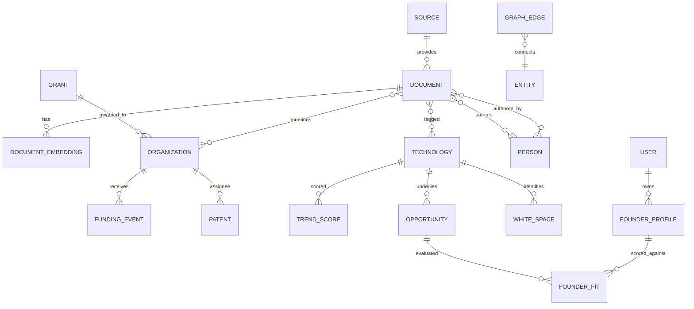

# Database Schema

PostgreSQL 16 + pgvector. Covers the relational model, vector storage, graph model, and deduplication strategy. SQL below is the canonical MVP schema (Alembic migrations derive from it).

---

## 1. Entity-relationship overview



---

## 2. Core tables

```sql
CREATE EXTENSION IF NOT EXISTS vector;
CREATE EXTENSION IF NOT EXISTS pg_trgm;       -- fuzzy dedup
CREATE EXTENSION IF NOT EXISTS "uuid-ossp";

-- ---------- Source registry ----------
CREATE TABLE source (
    id            UUID PRIMARY KEY DEFAULT uuid_generate_v4(),
    name          TEXT NOT NULL,                     -- 'arxiv', 'uspto', 'crunchbase'
    kind          TEXT NOT NULL,                     -- paper|patent|grant|funding|news
    base_url      TEXT,
    config        JSONB NOT NULL DEFAULT '{}',
    last_run_at   TIMESTAMPTZ,
    watermark     TEXT,                              -- cursor for incremental fetch
    enabled       BOOLEAN NOT NULL DEFAULT TRUE,
    created_at    TIMESTAMPTZ NOT NULL DEFAULT now()
);

-- ---------- Documents (papers, patents, grants, funding, news unified) ----------
CREATE TABLE document (
    id              UUID PRIMARY KEY DEFAULT uuid_generate_v4(),
    source_id       UUID NOT NULL REFERENCES source(id),
    doc_type        TEXT NOT NULL,                   -- paper|patent|grant|funding|news
    external_id     TEXT,                            -- DOI, patent no, grant id, etc.
    content_hash    TEXT NOT NULL,                   -- sha256 of normalized core fields
    title           TEXT NOT NULL,
    abstract        TEXT,
    body            TEXT,
    url             TEXT,
    published_at    DATE,
    raw_s3_key      TEXT,                            -- pointer to archived payload
    metadata        JSONB NOT NULL DEFAULT '{}',     -- type-specific fields
    extracted       JSONB,                           -- LLM structured extraction
    language        TEXT DEFAULT 'en',
    created_at      TIMESTAMPTZ NOT NULL DEFAULT now(),
    updated_at      TIMESTAMPTZ NOT NULL DEFAULT now(),
    UNIQUE (source_id, external_id),
    UNIQUE (content_hash)
);
CREATE INDEX idx_document_type_date   ON document (doc_type, published_at DESC);
CREATE INDEX idx_document_title_trgm  ON document USING gin (title gin_trgm_ops);
CREATE INDEX idx_document_metadata    ON document USING gin (metadata);
CREATE INDEX idx_document_fts         ON document USING gin (to_tsvector('english', coalesce(title,'')||' '||coalesce(abstract,'')));

-- ---------- Embeddings ----------
CREATE TABLE document_embedding (
    document_id   UUID PRIMARY KEY REFERENCES document(id) ON DELETE CASCADE,
    model         TEXT NOT NULL DEFAULT 'text-embedding-3-large',
    embedding     vector(3072) NOT NULL,
    created_at    TIMESTAMPTZ NOT NULL DEFAULT now()
);
CREATE INDEX idx_doc_embedding_hnsw ON document_embedding
    USING hnsw (embedding vector_cosine_ops) WITH (m = 16, ef_construction = 64);

-- ---------- Taxonomy ----------
CREATE TABLE technology (
    id          UUID PRIMARY KEY DEFAULT uuid_generate_v4(),
    slug        TEXT UNIQUE NOT NULL,                -- 'solid-state-electrolyte'
    name        TEXT NOT NULL,
    category    TEXT NOT NULL,                       -- chemistry|component|process|application
    parent_id   UUID REFERENCES technology(id),
    aliases     TEXT[] NOT NULL DEFAULT '{}',
    description TEXT,
    embedding   vector(3072)
);

-- ---------- Entities ----------
CREATE TABLE organization (
    id           UUID PRIMARY KEY DEFAULT uuid_generate_v4(),
    name         TEXT NOT NULL,
    org_type     TEXT,                               -- startup|corporate|university|lab|gov
    country      TEXT,
    homepage     TEXT,
    canonical_id UUID REFERENCES organization(id),   -- merge target for duplicates
    metadata     JSONB NOT NULL DEFAULT '{}',
    created_at   TIMESTAMPTZ NOT NULL DEFAULT now()
);
CREATE INDEX idx_org_name_trgm ON organization USING gin (name gin_trgm_ops);

CREATE TABLE person (
    id           UUID PRIMARY KEY DEFAULT uuid_generate_v4(),
    full_name    TEXT NOT NULL,
    orcid        TEXT,
    affiliation  TEXT,
    metadata     JSONB NOT NULL DEFAULT '{}'
);

-- ---------- Domain-specific signal tables ----------
CREATE TABLE patent (
    document_id   UUID PRIMARY KEY REFERENCES document(id) ON DELETE CASCADE,
    patent_number TEXT,
    assignee_org  UUID REFERENCES organization(id),
    filing_date   DATE,
    grant_date    DATE,
    cpc_codes     TEXT[]
);

CREATE TABLE grant_award (
    document_id   UUID PRIMARY KEY REFERENCES document(id) ON DELETE CASCADE,
    program       TEXT,                              -- DOE|ARPA-E|NSF|SBIR|STTR
    amount_usd    NUMERIC(14,2),
    awardee_org   UUID REFERENCES organization(id),
    start_date    DATE,
    end_date      DATE
);

CREATE TABLE funding_event (
    document_id   UUID REFERENCES document(id) ON DELETE CASCADE,
    id            UUID PRIMARY KEY DEFAULT uuid_generate_v4(),
    org_id        UUID REFERENCES organization(id),
    round         TEXT,                              -- seed|series_a|grant|debt
    amount_usd    NUMERIC(14,2),
    announced_at  DATE,
    investors     TEXT[]
);

-- ---------- Join tables (relational + graph projection) ----------
CREATE TABLE document_technology (
    document_id   UUID REFERENCES document(id) ON DELETE CASCADE,
    technology_id UUID REFERENCES technology(id) ON DELETE CASCADE,
    confidence    REAL NOT NULL DEFAULT 1.0,
    PRIMARY KEY (document_id, technology_id)
);
CREATE TABLE document_organization (
    document_id   UUID REFERENCES document(id) ON DELETE CASCADE,
    organization_id UUID REFERENCES organization(id) ON DELETE CASCADE,
    role          TEXT,                              -- assignee|awardee|author_affil|mentioned
    PRIMARY KEY (document_id, organization_id, role)
);
CREATE TABLE document_author (
    document_id UUID REFERENCES document(id) ON DELETE CASCADE,
    person_id   UUID REFERENCES person(id) ON DELETE CASCADE,
    position    INT,
    PRIMARY KEY (document_id, person_id)
);
```

---

## 3. Graph model (adjacency tables for MVP)

A single normalized edge table projects every relationship so the same data can later be bulk-loaded into Neo4j (ADR-001).

```sql
CREATE TABLE graph_edge (
    id          BIGSERIAL PRIMARY KEY,
    src_type    TEXT NOT NULL,    -- technology|document|organization|person|grant|funding
    src_id      UUID NOT NULL,
    edge_type   TEXT NOT NULL,    -- CITES|ASSIGNED_TO|FUNDED_BY|AUTHORED_BY|RELATES_TO|AWARDED
    dst_type    TEXT NOT NULL,
    dst_id      UUID NOT NULL,
    weight      REAL NOT NULL DEFAULT 1.0,
    metadata    JSONB NOT NULL DEFAULT '{}',
    created_at  TIMESTAMPTZ NOT NULL DEFAULT now(),
    UNIQUE (src_type, src_id, edge_type, dst_type, dst_id)
);
CREATE INDEX idx_edge_src ON graph_edge (src_type, src_id, edge_type);
CREATE INDEX idx_edge_dst ON graph_edge (dst_type, dst_id, edge_type);
```

**Example 1–2 hop query (recursive CTE) — "startups connected to solid-state electrolyte tech":**

```sql
WITH tech AS (
    SELECT id FROM technology WHERE slug = 'solid-state-electrolyte'
)
SELECT DISTINCT o.id, o.name
FROM graph_edge e1
JOIN graph_edge e2 ON e2.src_id = e1.dst_id AND e2.dst_type = 'organization'
JOIN organization o ON o.id = e2.dst_id AND o.org_type = 'startup'
WHERE e1.src_type = 'technology'
  AND e1.src_id IN (SELECT id FROM tech);
```

---

## 4. Derived / analytics tables

```sql
CREATE TABLE trend_score (
    id            UUID PRIMARY KEY DEFAULT uuid_generate_v4(),
    technology_id UUID REFERENCES technology(id),
    window_start  DATE NOT NULL,
    window_end    DATE NOT NULL,
    paper_growth        REAL,      -- normalized acceleration components
    patent_growth       REAL,
    funding_momentum    REAL,
    grant_momentum      REAL,
    composite_score     REAL NOT NULL,
    rank          INT,
    created_at    TIMESTAMPTZ NOT NULL DEFAULT now(),
    UNIQUE (technology_id, window_end)
);

CREATE TABLE opportunity (
    id              UUID PRIMARY KEY DEFAULT uuid_generate_v4(),
    title           TEXT NOT NULL,
    thesis          TEXT NOT NULL,
    technology_id   UUID REFERENCES technology(id),
    evidence        JSONB NOT NULL,   -- {paper_growth_pct, patents, invested_usd, providers}
    market          TEXT,
    technical_risk  TEXT,             -- low|medium|high
    commercial_potential TEXT,        -- low|medium|high
    confidence      REAL NOT NULL,    -- 0..1
    score           REAL NOT NULL,
    status          TEXT DEFAULT 'active',
    generated_at    TIMESTAMPTZ NOT NULL DEFAULT now()
);

CREATE TABLE white_space (
    id              UUID PRIMARY KEY DEFAULT uuid_generate_v4(),
    technology_id   UUID REFERENCES technology(id),
    research_activity REAL,
    funding_present   REAL,
    startup_density   REAL,
    whitespace_score  REAL NOT NULL,
    rationale       TEXT,
    detected_at     TIMESTAMPTZ NOT NULL DEFAULT now()
);

CREATE TABLE bottleneck (
    id              UUID PRIMARY KEY DEFAULT uuid_generate_v4(),
    technology_id   UUID REFERENCES technology(id),
    problem_statement TEXT NOT NULL,
    frequency       INT,              -- # of papers citing it as unsolved
    supporting_docs UUID[],
    severity        REAL,
    detected_at     TIMESTAMPTZ NOT NULL DEFAULT now()
);
```

---

## 5. User & founder-fit tables

```sql
CREATE TABLE app_user (
    id           UUID PRIMARY KEY DEFAULT uuid_generate_v4(),
    email        CITEXT UNIQUE NOT NULL,
    role         TEXT NOT NULL DEFAULT 'member',     -- founder|vc|corp|admin
    org_name     TEXT,
    created_at   TIMESTAMPTZ NOT NULL DEFAULT now()
);

CREATE TABLE founder_profile (
    id           UUID PRIMARY KEY DEFAULT uuid_generate_v4(),
    user_id      UUID REFERENCES app_user(id) ON DELETE CASCADE,
    education    JSONB,                              -- [{degree, field, institution}]
    skills       TEXT[] NOT NULL DEFAULT '{}',
    experience   JSONB,
    research_areas TEXT[] NOT NULL DEFAULT '{}',
    embedding    vector(3072),                       -- profile embedding for fit search
    created_at   TIMESTAMPTZ NOT NULL DEFAULT now()
);

CREATE TABLE founder_fit (
    id              UUID PRIMARY KEY DEFAULT uuid_generate_v4(),
    profile_id      UUID REFERENCES founder_profile(id) ON DELETE CASCADE,
    opportunity_id  UUID REFERENCES opportunity(id) ON DELETE CASCADE,
    fit_score       REAL NOT NULL,                   -- 0..1
    rationale       TEXT,
    skill_overlap   JSONB,
    created_at      TIMESTAMPTZ NOT NULL DEFAULT now(),
    UNIQUE (profile_id, opportunity_id)
);

CREATE TABLE weekly_report (
    id            UUID PRIMARY KEY DEFAULT uuid_generate_v4(),
    week_start    DATE NOT NULL UNIQUE,
    payload       JSONB NOT NULL,                    -- top techs/grants/startups/patents/opps
    s3_pdf_key    TEXT,
    generated_at  TIMESTAMPTZ NOT NULL DEFAULT now()
);
```

---

## 6. Deduplication strategy

Three-tier dedup, cheapest first:

1. **Exact ID match** — `(source_id, external_id)` and DOI/patent-number unique constraints reject re-ingestion.
2. **Content hash** — `content_hash = sha256(normalize(title)+normalize(abstract)+published_at)`; unique constraint catches the same artifact arriving from a different source.
3. **Fuzzy/semantic** — for near-duplicates (preprint vs. published, reworded news), a candidate set is found via `pg_trgm` title similarity (`> 0.6`) **and** embedding cosine similarity (`> 0.92`); matches are linked, not duplicated, via a `canonical_document_id` pointer (added in migration when fuzzy-dedup ships).

Entity dedup (orgs/people) uses the same trigram + embedding approach with a `canonical_id` self-reference for merges.

---

## 7. Indexing & partitioning notes

- HNSW on embeddings; tune `ef_search` per query for recall/latency.
- Partition `document` by `published_at` (yearly) once it exceeds ~10M rows.
- Materialized views for dashboard aggregates (`mv_tech_activity_monthly`), refreshed by the analytics workers, not on request.
