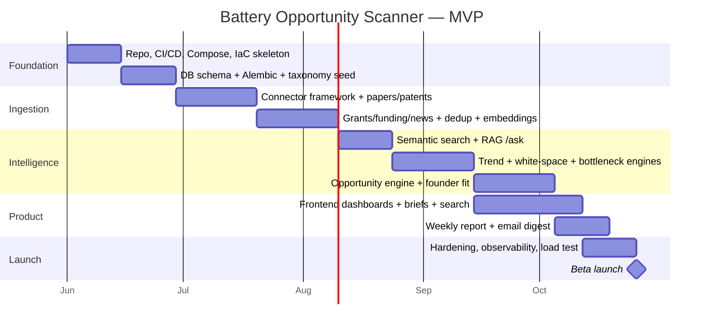

# MVP Roadmap, Milestones, Timeline & Cost

## 1. MVP scope (what ships in Phase 1)

In: daily ingestion from all listed sources, dedup, embeddings, relational+vector+adjacency-graph storage, semantic search, trend scoring, opportunity briefs, white-space + bottleneck detection, founder-fit, weekly report, dashboards.
Out (Phase 2+): Neo4j migration, real-time alerts, multi-tenant orgs/billing, fine-grained RBAC, mobile, non-English sources.

---

## 2. Milestone breakdown

| # | Milestone | Exit criteria |
|---|-----------|---------------|
| M1 | Foundation | CI green, Compose up, Terraform plan applies to staging |
| M2 | Data model | Migrations + taxonomy seeded; sample data loads |
| M3 | Connectors v1 | Papers + patents ingest daily, idempotent, archived to S3 |
| M4 | Full ingestion | All sources live; dedup rate measured; embeddings populated |
| M5 | Search/RAG | Hybrid search + `/ask` with citations in staging |
| M6 | Detection engines | Trend/white-space/bottleneck tables populated + ranked |
| M7 | Opportunity + fit | Briefs generated with confidence; founder-fit ranking works |
| M8 | Frontend | All dashboards functional against staging API |
| M9 | Reports | Weekly report generates + emails |
| M10 | Launch-ready | p95 SLOs met under load test; observability + alerts live |

---

## 3. Estimated development timeline

**~16–20 weeks** to beta with a small senior team. Critical path runs Foundation → Ingestion → Detection → Opportunity; frontend parallelizes from M6.

Recommended team:
- 1 backend/data engineer (pipelines, DB, connectors)
- 1 ML/AI engineer (embeddings, RAG, scoring engines)
- 1 full-stack/frontend engineer (Next.js)
- 0.5 DevOps (IaC, CI/CD, observability)
- 0.5 PM/domain (battery taxonomy, validation)

A solo founder-engineer can reach a thinner MVP (fewer sources, no Terraform, manual deploys) in ~10–12 weeks.

---

## 4. Cost estimate

### Monthly infrastructure (AWS, MVP / beta load)

| Item | Spec | ~Monthly |
|------|------|----------|
| RDS PostgreSQL (pgvector) | db.r6g.large + 200GB + 1 replica | $400–600 |
| ElastiCache Redis | cache.t4g.medium | $60 |
| ECS Fargate (api + workers) | ~4–8 tasks avg | $200–400 |
| S3 + CloudFront | payloads, reports, static | $30–80 |
| ALB + data transfer | | $40 |
| Monitoring (Sentry/CloudWatch) | | $50 |
| **Infra subtotal** | | **~$800–1,200** |

### AI / OpenAI (corpus-driven, not user-driven)

| Item | Assumption | ~Monthly |
|------|-----------|----------|
| Embeddings | ~300k new docs/mo @ 3-large, batched | $150–300 |
| Bulk extraction (4o-mini) | structured fields per doc | $200–500 |
| Synthesis (4o): briefs, reports, /ask | bounded + cached | $300–800 |
| **AI subtotal** | | **~$650–1,600** |

### Data access
Crunchbase / Pitchbook-grade data is the wild card — public/free tiers for MVP, budget **$0–2,000/mo** if licensing paid feeds later. Use free sources (Semantic Scholar, arXiv, PatentsView, USPTO, NSF/DOE/SBIR APIs, RSS) first.

**Total MVP run rate: ~$1,500–3,000/mo** infra+AI (excluding paid data licenses and salaries).

---

## 5. Deployment strategy (summary)

Docker images → ECR → ECS Fargate via GitHub Actions. `local → staging → prod`, Terraform-managed, Alembic migrations as one-off ECS task pre-deploy, rolling deploys with health-check auto-rollback. Full detail in [ARCHITECTURE.md](ARCHITECTURE.md#6-deployment-strategy).

---

## 6. Risks & mitigations

| Risk | Mitigation |
|------|-----------|
| Paid data sources (Crunchbase/Pitchbook) costly/ToS-restricted | Start with free/public sources; abstract behind connector interface; add paid feeds when revenue justifies |
| Scraper fragility (Google Patents, journal sites) | Prefer official APIs (PatentsView, Semantic Scholar, OpenAlex); isolate scrapers; alert on connector failure |
| LLM hallucination in briefs | Scores are deterministic; LLM only narrates grounded evidence; citations required; confidence gating |
| Vector store outgrows pgvector | Partition + monitor recall/latency; planned migration path to Qdrant/Pinecone past ~50M vectors |
| Trend false positives | Mann-Kendall significance + backtesting against known winners |
| Cost creep | Model tiering (mini vs 4o), batching, semantic caching, precompute-not-per-request |

---

## 7. Post-MVP (Phase 2+)

Neo4j graph migration + centrality/community features · real-time opportunity alerts · org/team workspaces + billing · saved searches & watchlists · investor/portfolio overlap analysis · API product for VC tooling · expanded global + non-English sources.
